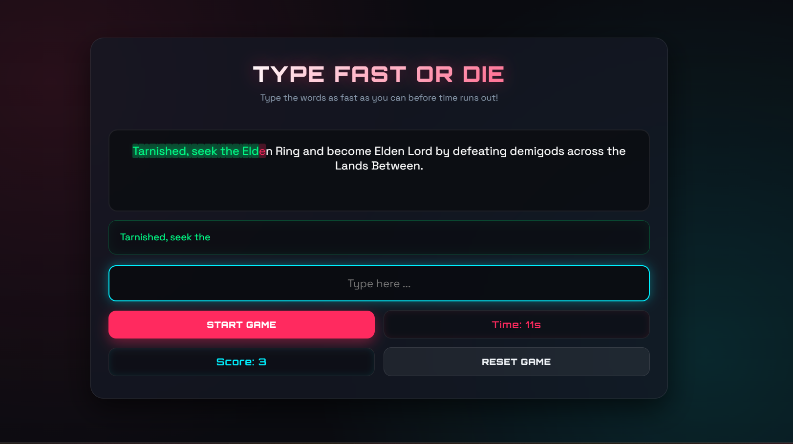

# Type Fast Or Die game

## Technologies Used

1. HTML

2. CSS

3. JavaScript

## Description

it's a Speed Typing game, you should write the paragraph you see in the page before the time ends

## User Stories

1. As a User, I want to see the paragaraph show on the page

2. As a User, I want to click on a keyboard to place my letters

3. As a User, I want to  see if I win if I get all the paragraph words

4. As a User, I want to see a lose message if I don't get it

5. As a User I want to see a restart button

## Future Enhancements

1. Game Mode 

2. Category Selection

3. Mistake Counter

